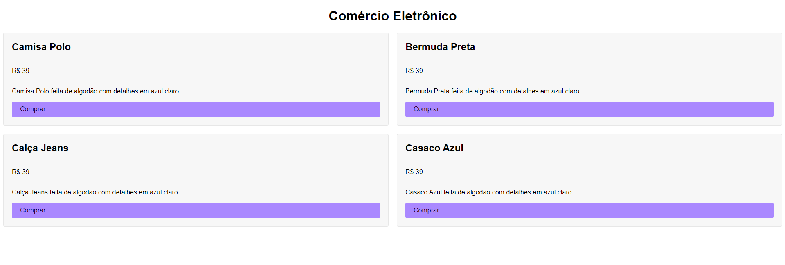
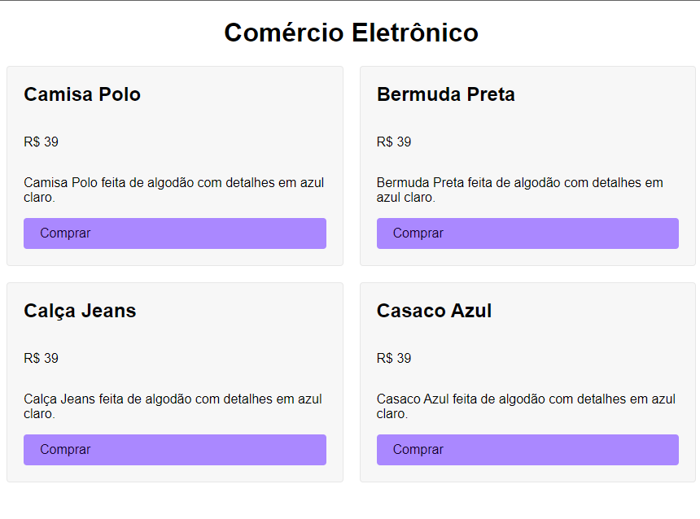

## 🎨 Layout

 

  
  

## 💻 Projeto

Nesse projeto foi utilizado os conceitos de Grid Columns que foi estudado no curso do Origamid.

 

## 🚀 Tecnologias

As seguintes ferramentas foram usadas na construção do projeto: 

- HTML
- CSS

 

## 📝 Licença

Este projeto está sobe a licença MIT.
